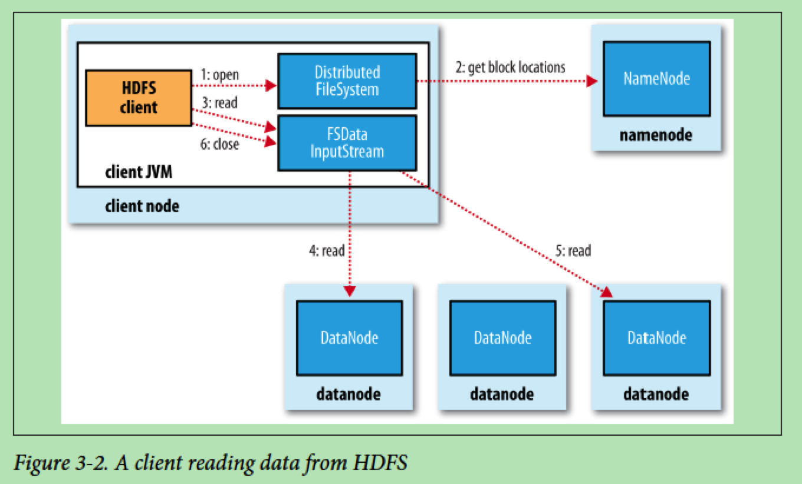

# HDFS: Hadoop Distributed Filesystem

## 资源

+ The Google File System, by Sanjay Ghemawat and Howard Gobioff and Shun-Tak Leung, 2003.
+ The Hadoop Distributed File System, by Konstantin Shvachko and Hairong Kuang and Sanjay Radia and Robert Chansler, 2010.

## 图例

### 客户端从HDFS中读取数据



1. 客户端调用`FileSystem.open()`打开文件, 在HDFS中是`DistributedFileSystem`;
2. `DistributedFileSystem`使用RPC访问namenode, 确定文件的头几个块的位置, 返回`FSDataInputStream`, 它封装了`DFSInputStream`, 后者负责管理与datanode和namenode的I/O;
3. 客户端调用`FSDataInputStream.read()`, `DFSInputStream`连接到文件第一个块最近的datanode.
4. 数据从datanode流向客户端;
5. 读完一块时, `DFSInputStream`关闭到datanode的连接, 找到下一个块的最近的datanode;
6. 客户端读取完毕, 调用`FSDataInputStream.close()`.

### 客户端写入数据到HDFS中


1. 客户端调用`DistributedFileSystem.create()`创建文件;
2. `DistributedFileSystem`使用RPC访问namenode创建没有块的新文件; 返回`FSDataOutputStream`, 它封装了`DFSOutputStream`, 后者负责管理与datanode和namenode的I/O;
3. 客户端调用`FSDataOutputStream.write()`写入数据, `DFSOutputStream`将其拆分为包, 写入内部数据队列(data queue); 数据队列被`DataStreamer`(hadoop-hdfs-client)消费, 它负责请求namenode分配新块, 并选择合适的datanode放置数据副本, 这些datanode构成数据管道;
4. `DataStreamer`将包发送到管道中的第一个datanode, 这个datanode存储包并转发到下一个datanode, 下一个datanode存储包并转发, 依次类推;
5. `DFSOutputStream`维护了需要被datanode确认的包队列(ack queue), 在包被数据管道中所有datanode确认后才可移除; 这里有数据管道失败的处理;
6. 客户端写入完毕, 调用`FSDataOutputStream.close()`, 刷出到datanode管道的剩余的包, 在告知namenode文件已结束之前等待确认.

## 概念

- block
- namenode, datanode, secondary namenode
- HDFS Federation
- HDFS High Availability: QJM(quorum journal manager)
- 支持的文件系统见`org.apache.hadoop.fs.AbstractFileSystem`的具体实现
- 应用使用`org.apache.hadoop.fs.FileSystem`: `FSDataInputStream`, `FSDataOutputStream`, `FileStatus`

> java.io.DataOutputStream.flush(): Flushes this data output stream.<br>
> FSDataOutputStream.hflush(): Flush out the data in client's user buffer.<br>
> FSDataOutputStream.hsync(): Similar to posix fsync, flush out the data in client's user buffer all the way to the disk device (but the disk may have it in its cache).

- distcp: 并行拷贝工具
- 数据完整性: 校验和 CRC-32C
- 压缩格式: DEFLATE, gzip, bzip2, LZO, LZ4, Snappy

## Packages

### org.apache.hadoop.hdfs

- `MiniDFSCluster`: This class creates a single-process DFS cluster for junit testing


## RTFSC

### Questions

- 启动入口在哪里? 依次启动那些组件?
- 是如何处理客户端的并发写入和读取的?
- 组件: 为什么要用这些组件? 使用了那些数据结构(包括协议)和过程?


### 启动入口

- sbin/start-dfs.sh

```
bin/hdfs start namenode
bin/hdfs start datanode
bin/hdfs start secondarynamenode (if any)
bin/hdfs start journalnode (if any): dfs.namenode.shared.edits.dir
bin/hdfs start zkfc (if auto-HA is enabled): dfs.ha.automatic-failover.enabled
```

- libexec/hdfs-config.sh
- libexec/hadoop-config.sh
- bin/hdfs
- sbin/hadoop-daemons.sh


##### bin/hdfs

- getconf: org.apache.hadoop.hdfs.tools.GetConf
- namenode: org.apache.hadoop.hdfs.server.namenode.NameNode
- datanode: org.apache.hadoop.hdfs.server.datanode.DataNode
- secondarynamenode: org.apache.hadoop.hdfs.server.namenode.SecondaryNameNode
- journalnode: org.apache.hadoop.hdfs.qjournal.server.JournalNode
- zkfc: org.apache.hadoop.hdfs.tools.DFSZKFailoverController
- others


### 组件

#### NameNode

```
package org.apache.hadoop.hdfs.server.namenode;

/**********************************************************
 * NameNode serves as both directory namespace manager and
 * "inode table" for the Hadoop DFS.  There is a single NameNode
 * running in any DFS deployment.  (Well, except when there
 * is a second backup/failover NameNode, or when using federated NameNodes.)
 *
 * The NameNode controls two critical tables:
 *   1)  filename->blocksequence (namespace)
 *   2)  block->machinelist ("inodes")
 *
 * The first table is stored on disk and is very precious.
 * The second table is rebuilt every time the NameNode comes up.
 *
 * 'NameNode' refers to both this class as well as the 'NameNode server'.
 * The 'FSNamesystem' class actually performs most of the filesystem
 * management.  The majority of the 'NameNode' class itself is concerned
 * with exposing the IPC interface and the HTTP server to the outside world,
 * plus some configuration management.
 *
 * NameNode implements the
 * {@link org.apache.hadoop.hdfs.protocol.ClientProtocol} interface, which
 * allows clients to ask for DFS services.
 * {@link org.apache.hadoop.hdfs.protocol.ClientProtocol} is not designed for
 * direct use by authors of DFS client code.  End-users should instead use the
 * {@link org.apache.hadoop.fs.FileSystem} class.
 *
 * NameNode also implements the
 * {@link org.apache.hadoop.hdfs.server.protocol.DatanodeProtocol} interface,
 * used by DataNodes that actually store DFS data blocks.  These
 * methods are invoked repeatedly and automatically by all the
 * DataNodes in a DFS deployment.
 *
 * NameNode also implements the
 * {@link org.apache.hadoop.hdfs.server.protocol.NamenodeProtocol} interface,
 * used by secondary namenodes or rebalancing processes to get partial
 * NameNode state, for example partial blocksMap etc.
 **********************************************************/
@InterfaceAudience.Private
public class NameNode extends ReconfigurableBase implements
    NameNodeStatusMXBean
```

- 聚合`FSNamesystem`管理文件系统
- 实现的协议: `ClientProtocol`, `DatanodeProtocol`, `NamenodeProtocol`
- 角色`HdfsServerConstants.NamenodeRole`: `NAMENODE`, `BACKUP`, `CHECKPOINT`

- 创建实例: `NameNode.createNameNode(String[], Configuration)`
- 初始化: `NameNode.initialize(Configuration)`

```
NameNode.loginAsNameNodeUser(Configuration)
NameNode.initMetrics(Configuration, NamenodeRole)
NameNode.startHttpServer(Configuration)
NameNode.loadNamesystem(Configuration)
|-- FSNamesystem.loadFromDisk(Configuration)    // 加载fsimage和edits日志
NameNode.createRpcServer(Configuration)         // rpcServer
|-- NameNodeRpcServer.NameNodeRpcServer(Configuration, NameNode)
NameNode.initReconfigurableBackoffKey()
NameNode.startCommonServices(Configuration)
|-- FSNamesystem.startCommonServices(Configuration, HAContext)
NameNode.startMetricsLogger(Configuration)
```

##### NameNodeRpcServer

> public class NameNodeRpcServer implements NamenodeProtocols

- serviceRpcServer: 监听DN请求
- lifelineRpcServer: 监听lifeline请求
- clientRpcServer: 监听客户端请求

构造过程:

(1) PB BlockingService

- clientNNPbService: ClientNamenodeProtocol, ClientNamenodeProtocolServerSideTranslatorPB
- dnProtoPbService: DatanodeProtocolService, DatanodeProtocolServerSideTranslatorPB
- lifelineProtoPbService: DatanodeLifelineProtocolService, DatanodeLifelineProtocolServerSideTranslatorPB
- NNPbService: NamenodeProtocolService, NamenodeProtocolServerSideTranslatorPB
- refreshAuthService: RefreshUserMappingsProtocolService, RefreshUserMappingsProtocolServerSideTranslatorPB
- refreshCallQueueService: RefreshCallQueueProtocolService, RefreshCallQueueProtocolServerSideTranslatorPB
- genericRefreshService: GenericRefreshProtocolService, GenericRefreshProtocolServerSideTranslatorPB
- getUserMappingService: GetUserMappingsProtocolService, GetUserMappingsProtocolServerSideTranslatorPB
- haPbService: HAServiceProtocolService, HAServiceProtocolServerSideTranslatorPB
- reconfigurationPbService: ReconfigurationProtocolService, ReconfigurationProtocolServerSideTranslatorPB
- traceAdminService: TraceAdminService, TraceAdminProtocolServerSideTranslatorPB

(2) serviceRpcServer

> dfs.namenode.servicerpc-address

协议:

- clientNNPbService
- haPbService
- reconfigurationPbService
- NNPbService
- dnProtoPbService
- refreshAuthService
- refreshUserMappingService
- refreshCallQueueService
- genericRefreshService
- getUserMappingService
- traceAdminService


(3) lifelineRpcServer

> dfs.namenode.lifeline.rpc-address, dfs.namenode.lifeline.rpc-bind-host

- haPbService
- lifelineProtoPbService


(4) clientRpcServer

- clientNNPbService
- haPbService
- reconfigurationPbService
- NNPbService
- dnProtoPbService
- refreshAuthService
- refreshUserMappingService
- refreshCallQueueService
- genericRefreshService
- getUserMappingService
- traceAdminService

#### SecondaryNameNode

```
/**********************************************************
 * The Secondary NameNode is a helper to the primary NameNode.
 * The Secondary is responsible for supporting periodic checkpoints
 * of the HDFS metadata. The current design allows only one Secondary
 * NameNode per HDFs cluster.
 *
 * The Secondary NameNode is a daemon that periodically wakes
 * up (determined by the schedule specified in the configuration),
 * triggers a periodic checkpoint and then goes back to sleep.
 * The Secondary NameNode uses the NamenodeProtocol to talk to the
 * primary NameNode.
 *
 **********************************************************/
public class SecondaryNameNode implements Runnable,
        SecondaryNameNodeInfoMXBean
```

因为NN在启动时合并fsimage和edits日志文件, 周期性的合并fsimage和edits日志文件.


```
public static void main(String[] argv) throws Exception

  secondary = new SecondaryNameNode(tconf, opts);

  // SecondaryNameNode can be started in 2 modes:
  // 1. run a command (i.e. checkpoint or geteditsize) then terminate
  // 2. run as a daemon when {@link #parseArgs} yields no commands

  // mode 2
  secondary.startInfoServer();
  secondary.startCheckpointThread();
  secondary.join();
```

```
SecondaryNameNode.doCheckpoint()
|-- SecondaryNameNode.doMerge
|--|-- FSImage.reloadFromImageFile            // 加载fsimage
|--|--|-- FSImage.loadFSImage
|--|-- Checkpointer.rollForwardByApplyingLogs // 前向应用edits日志
|--|--|-- FSImage.loadEdits
|--|--|--|-- FSEditLogLoader.loadFSEdits
|--|--|--|--|-- FSEditLogLoader.loadEditRecords
|--|--|--|--|--|-- FSEditLogLoader.applyEditLogOp

switch (op.opCode) { // edits日志中操作
  org.apache.hadoop.hdfs.server.namenode.FSEditLogOpCodes
```


#### BackupNode


```
package org.apache.hadoop.hdfs.server.namenode;

/**
 * BackupNode.
 * <p>
 * Backup node can play two roles.
 * <ol>
 * <li>{@link NamenodeRole#CHECKPOINT} node periodically creates checkpoints,
 * that is downloads image and edits from the active node, merges them, and
 * uploads the new image back to the active.</li>
 * <li>{@link NamenodeRole#BACKUP} node keeps its namespace in sync with the
 * active node, and periodically creates checkpoints by simply saving the
 * namespace image to local disk(s).</li>
 * </ol>
 */
public class BackupNode extends NameNode
```

- checkpoint: org.apache.hadoop.hdfs.server.common.HdfsServerConstants.StartupOption.CHECKPOINT

周期性的创建文件命名空间的检查点: 从活跃NN下载fsimage和edits日志文件, 本地合并, 再上传给活跃NN.

启动: `bin/hdfs namenode -checkpoint`.

- backup: org.apache.hadoop.hdfs.server.common.HdfsServerConstants.StartupOption.BACKUP

在内存中维护与活跃NN状态同步的文件系统命名空间, 也接收并持久化edits日志流. 启动: `bin/hdfs namenode -backup`.

- Checkpointer

```
package org.apache.hadoop.hdfs.server.namenode;

/**
 * The Checkpointer is responsible for supporting periodic checkpoints
 * of the HDFS metadata.
 *
 * The Checkpointer is a daemon that periodically wakes up
 * up (determined by the schedule specified in the configuration),
 * triggers a periodic checkpoint and then goes back to sleep.
 *
 * The start of a checkpoint is triggered by one of the two factors:
 * (1) time or (2) the size of the edits file.
 */
class Checkpointer extends Daemon
```


#### DataNode

```
package org.apache.hadoop.hdfs.server.datanode;

/**********************************************************
 * DataNode is a class (and program) that stores a set of
 * blocks for a DFS deployment.  A single deployment can
 * have one or many DataNodes.  Each DataNode communicates
 * regularly with a single NameNode.  It also communicates
 * with client code and other DataNodes from time to time.
 *
 * DataNodes store a series of named blocks.  The DataNode
 * allows client code to read these blocks, or to write new
 * block data.  The DataNode may also, in response to instructions
 * from its NameNode, delete blocks or copy blocks to/from other
 * DataNodes.
 *
 * The DataNode maintains just one critical table:
 *   block-> stream of bytes (of BLOCK_SIZE or less)
 *
 * This info is stored on a local disk.  The DataNode
 * reports the table's contents to the NameNode upon startup
 * and every so often afterwards.
 *
 * DataNodes spend their lives in an endless loop of asking
 * the NameNode for something to do.  A NameNode cannot connect
 * to a DataNode directly; a NameNode simply returns values from
 * functions invoked by a DataNode.
 *
 * DataNodes maintain an open server socket so that client code
 * or other DataNodes can read/write data.  The host/port for
 * this server is reported to the NameNode, which then sends that
 * information to clients or other DataNodes that might be interested.
 *
 **********************************************************/
public class DataNode extends ReconfigurableBase
    implements InterDatanodeProtocol, ClientDatanodeProtocol,
        TraceAdminProtocol, DataNodeMXBean, ReconfigurationProtocol
```

#### JournalNode


#### DFSZKFailoverController


### 数据结构

##### FSNamesystem

> public class FSNamesystem implements Namesystem, FSNamesystemMBean, NameNodeMXBean

```
FSNamesystem does the actual bookkeeping work for the DataNode.

It tracks several important tables.

1)  valid fsname --> blocklist  (kept on disk, logged)
2)  Set of all valid blocks (inverted #1)
3)  block --> machinelist (kept in memory, rebuilt dynamically from reports)
4)  machine --> blocklist (inverted #2)
5)  LRU cache of updated-heartbeat machines
```

配置:

- FSNamesystem.getNamespaceDirs(Configuration): `dfs.namenode.name.dir`
- FSNamesystem.getNamespaceEditsDirs(Configuration): `dfs.namenode.shared.edits.dir`, `dfs.namenode.edits.dir`
- FSNamesystem.getRequiredNamespaceEditsDirs(Configuration): `dfs.namenode.edits.dir.required`, `dfs.namenode.shared.edits.dir`
- FSNamesystem.getSharedEditsDirs(Configuration): `dfs.namenode.shared.edits.dir`
- resourceRecheckInterval: `dfs.namenode.resource.check.interval`
- supergroup: `dfs.permissions.superusergroup`
- isPermissionEnabled: `dfs.permissions.enabled`
- serverDefaults: FsServerDefaults: `dfs.checksum.type`, `dfs.blocksize`, `dfs.bytes-per-checksum`, `dfs.client-write-packet-size`, `dfs.replication`, `io.file.buffer.size`, `dfs.encrypt.data.transfer`, `fs.trash.interval`, `hadoop.security.key.provider.path`
- maxFsObjects: `dfs.namenode.max.objects`
- minBlockSize: `dfs.namenode.fs-limits.min-block-size`
- maxBlocksPerFile: `dfs.namenode.fs-limits.max-blocks-per-file`
- numCommittedAllowed: `dfs.namenode.file.close.num-committed-allowed`
- supportAppends: `dfs.support.append`
- maxCorruptFileBlocksReturn: `dfs.namenode.max-corrupt-file-blocks-returned`
- dtpReplaceDatanodeOnFailure: ReplaceDatanodeOnFailure // replace-datanode-on-failure特性的配置, `dfs.client.block.write.replace-datanode-on-failure.enable`, `dfs.client.block.write.replace-datanode-on-failure.policy`, `dfs.client.block.write.replace-datanode-on-failure.best-effort`
- standbyShouldCheckpoint: `dfs.ha.standby.checkpoints`
- editLogRollerThreshold, editLogRollerInterval: `dfs.namenode.edit.log.autoroll.multiplier.threshold`, `dfs.namenode.checkpoint.txns`, `dfs.namenode.edit.log.autoroll.check.interval.ms`
- lazyPersistFileScrubIntervalSec: `dfs.namenode.lazypersist.file.scrub.interval.sec`
- edekCacheLoaderDelay, edekCacheLoaderInterval: `dfs.namenode.edekcacheloader.initial.delay.ms`, `dfs.namenode.edekcacheloader.interval.ms`
- leaseRecheckIntervalMs, maxLockHoldToReleaseLeaseMs: `dfs.namenode.lease-recheck-interval-ms`, `dfs.namenode.max-lock-hold-to-release-lease-ms`
- inodeAttributeProvider: INodeAttributeProvider // `dfs.namenode.inode.attributes.provider.class`
- maxListOpenFilesResponses: `dfs.namenode.list.openfiles.num.responses`
- blockDeletionIncrement: `dfs.namenode.block.deletion.increment`

聚合:

- fsLock, cond: FSNamesystemLock, `java.util.concurrent.locks.Condition` // 模拟`java.util.concurrent.locks.ReentrantReadWriteLock`
- cpLock: ReentrantLock // checkpoint用的锁
- fsImage: FSImage // 处理名称空间上edits的checkpointing和logging
- nameserviceId: // HA模式下名称服务ID
- blockManager: BlockManager // 块管理器, 尝试维护足够的活跃副本数量
- datanodeStatistics: DatanodeStatistics // DN统计信息
- dir: FSDirectory // 管理名称空间, 纯内存结构
- snapshotManager: SnapshotManager // 快照管理器
- cacheManager: CacheManager // DN中缓存的管理器
- retryCache: RetryCache // 非幂等请求重试的缓存

构造: `FSNamesystem.loadFromDisk(Configuration)`

- FSNamesystem.FSNamesystem(Configuration, FSImage, boolean)
- FSNamesystem.loadFSImage(StartupOption)

```
FSImage.format(FSNamesystem, String) // 指定了-format时
FSImage.recoverTransitionRead(StartupOption, FSNamesystem, MetaRecoveryContext)
FSImage.saveNamespace(FSNamesystem) // 需要保存名称空间时
FSImage.openEditLogForWrite(int) // 非standby时, 开启新的edits日志
```

##### FSImage

```
/**
 * FSImage handles checkpointing and logging of the namespace edits.
 */
public class FSImage implements Closeable
```

- 离线查看: OfflineImageViewerPB

聚合:

- editLog: org.apache.hadoop.hdfs.server.namenode.FSEditLog
- storage: org.apache.hadoop.hdfs.server.namenode.NNStorage


##### FSEditLog

```
/**
 * FSEditLog maintains a log of the namespace modifications.
 */
public class FSEditLog implements LogsPurgeable
```

- 离线查看: OfflineEditsViewer


### 协议

#### ClientProtocol

```
package org.apache.hadoop.hdfs.protocol;

/**********************************************************************
 * ClientProtocol is used by user code via the DistributedFileSystem class to
 * communicate with the NameNode.  User code can manipulate the directory
 * namespace, as well as open/close file streams, etc.
 *
 **********************************************************************/
public interface ClientProtocol
```

#### DatanodeProtocol

```
package org.apache.hadoop.hdfs.server.protocol;

/**********************************************************************
 * Protocol that a DFS datanode uses to communicate with the NameNode.
 * It's used to upload current load information and block reports.
 *
 * The only way a NameNode can communicate with a DataNode is by
 * returning values from these functions.
 *
 **********************************************************************/
public interface DatanodeProtocol
```

#### NamenodeProtocol

```
package org.apache.hadoop.hdfs.server.protocol;

/*****************************************************************************
 * Protocol that a secondary NameNode uses to communicate with the NameNode.
 * It's used to get part of the name node state
 *****************************************************************************/
public interface NamenodeProtocol
```
