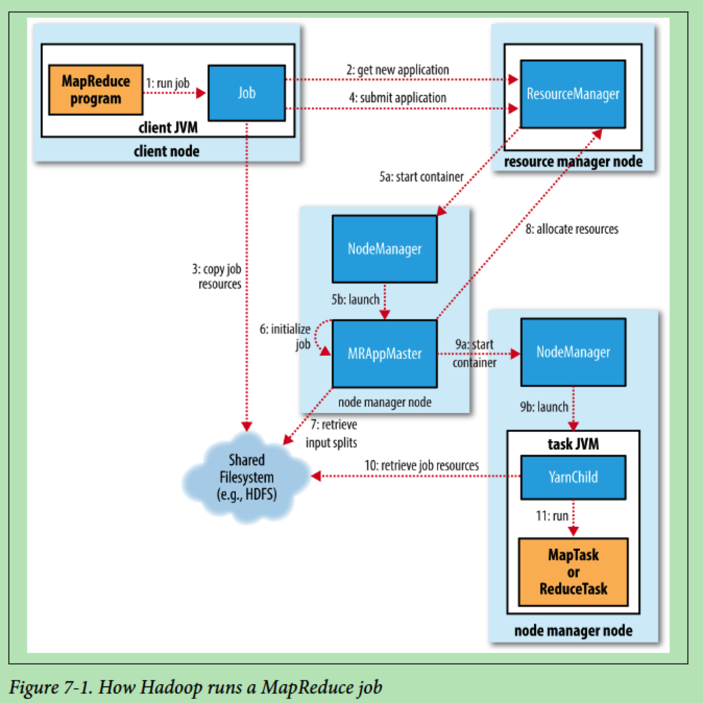
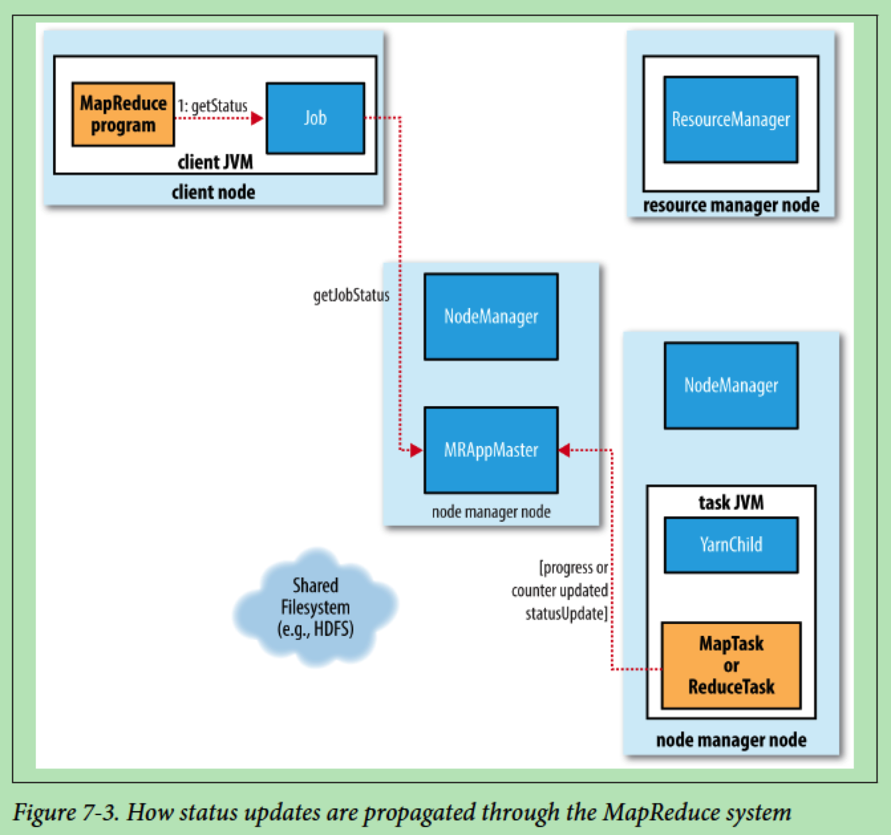

# MapReduce

## 资源

+ MapReduce: simplified data processing on large clusters, by Jeffrey Dean and Sanjay Ghemawat, 2008.

## 图例

### Hadoop如何运行MapReduce作业

### MapReduce系统中的状态是如何传播的

### MapReduce中shuffle和sort

## Packages

### org.apache.hadoop.mapred

### org.apache.hadoop.mapreduce

- `Job`, `JobID`, `JobStatus`, `JobContext`
- `InputSplit`, `InputFormat<K,V>`, `OutputFormat<K,V>`
- `TaskID`, `TaskAttemptID`, `TaskCompletionEvent`, `TaskAttemptContext`, `TaskInputOutputContext<KEYIN,VALUEIN,KEYOUT,VALUEOUT>`, `TaskTrackerInfo`
- `Mapper<KEYIN,VALUEIN,KEYOUT,VALUEOUT>`, `MapContext<KEYIN,VALUEIN,KEYOUT,VALUEOUT>`, `RecordReader<KEYIN,VALUEIN>`
- `Reducer<KEYIN,VALUEIN,KEYOUT,VALUEOUT>`, `ReduceContext<KEYIN,VALUEIN,KEYOUT,VALUEOUT>`, `RecordWriter<K,V>`
