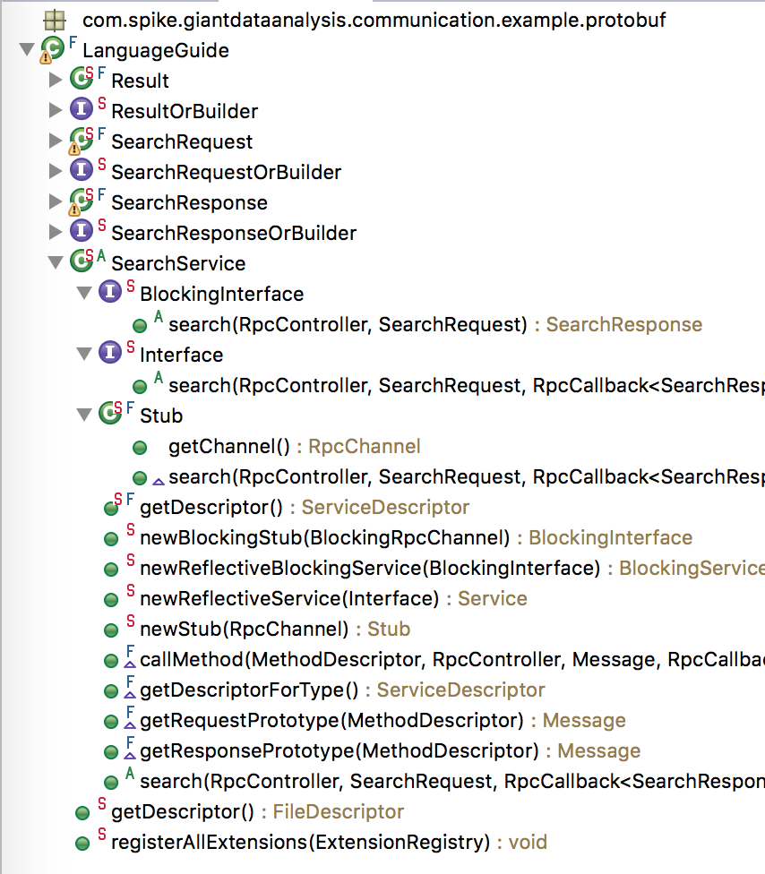

# Motivation

计算+通信中的**通信**基础设施积累.

# 0 实践版本

	Protocol Buffers: 2.5.0, 3.6.1
	gRPC: 1.17.1
	Apache Thrift: 0.11.0
	Apache Avro: 1.8.2

# 1 资源

## Protocol Buffers

+ https://developers.google.com/protocol-buffers/docs/overview

Protocol Buffers (a.k.a., protobuf) are Google's language-neutral, platform-neutral, extensible mechanism for serializing structured data.

+ Protocol Buffer Language Guide: https://developers.google.com/protocol-buffers/docs/proto
+ Java API Reference: https://developers.google.com/protocol-buffers/docs/reference/java/index.html
+ Java Generated Code Guide: https://developers.google.com/protocol-buffers/docs/reference/java-generated
+ Encoding Reference: https://developers.google.com/protocol-buffers/docs/encoding
+ Maven Protocol Buffers Plugin: https://www.xolstice.org/protobuf-maven-plugin/
+ Google Protocol Buffer 的使用和原理: https://www.ibm.com/developerworks/cn/linux/l-cn-gpb/index.html

		syntax = "proto2";

		package tutorial;

		option
		java_package = "com.spike.giantdataanalysis.communication.example.protobuf";
		option java_outer_classname = "LanguageGuide";
		// https://developers.google.com/protocol-buffers/docs/reference/java-generated#service
		option java_generic_services = true;
		message SearchRequest {
			required string query = 1;
			optional int32 page_number = 2;
			optional int32 result_per_page = 3 [default = 10];
			// 枚举
			enum Corpus {
				UNIVERSAL = 0;
				WEB = 1;
				IMAGES = 2;
				LOCAL = 3;
				NEWS = 4;
				PRODUCTS = 5;
				VIDEO = 6;
			}

			optional Corpus corpus = 4 [default = UNIVERSAL];
		}

		message SearchResponse {
			repeated Result result = 1;
		}

		message Result {
			required string url = 1;
			optional string title = 2;
			repeated string snippets = 3;
		}

		service SearchService {
			rpc Search (SearchRequest) returns (SearchResponse);
		}

生成的代码

when implementing your own service, you have two options:

Subclass SearchService and implement its methods as appropriate, then hand instances of your subclass directly to the RPC server implementation. This is usually easiest, but some consider it less "pure".
Implement SearchService.Interface and use SearchService.newReflectiveService(SearchService.Interface) to construct a Service wrapping it, then pass the wrapper to your RPC implementation.

Stub: The protocol buffer compiler also generates a "stub" implementation of every service interface, which is used by clients wishing to send requests to servers implementing the service.

The Protocol Buffer library does not include an RPC implementation. However, it includes all of the tools you need to hook up a generated service class to any arbitrary RPC implementation of your choice. You need only provide implementations of RpcChannel/BlockingRpcChannel and RpcController.

## Apache Thrift

https://zh.wikipedia.org/wiki/Thrift
https://thrift.apache.org/
Thrift是一种接口描述语言和二进制通讯协议，它被用来定义和创建跨语言的服务。它被当作一个远程过程调用（RPC）框架来使用，是由Facebook为“大规模跨语言服务开发”而开发的。

+ Thrift interface description language: https://thrift.apache.org/docs/idl
+ Thrift Types: https://thrift.apache.org/docs/types
+ Thrift network stack: https://thrift.apache.org/docs/concepts
+ Java Tutorial: https://thrift.apache.org/tutorial/java

		  +-------------------------------------------+
		  | Server                                    |
		  | (single-threaded, event-driven etc)       |
		  +-------------------------------------------+
		  | Processor                                 |
		  | (compiler generated)                      |
		  +-------------------------------------------+
		  | Protocol                                  |
		  | (JSON, compact etc)                       |
		  +-------------------------------------------+
		  | Transport                                 |
		  | (raw TCP, HTTP etc)                       |
		  +-------------------------------------------+

## Apache Avro

+ https://zh.wikipedia.org/wiki/Apache_Avro
+ https://avro.apache.org/docs/current/

Avro是一种远程过程调用和数据序列化框架，是在Apache的Hadoop项目之内开发的。它使用JSON来定义数据类型和通讯协议，使用压缩二进制格式来序列化数据。它主要用于Hadoop，它可以为持久化数据提供一种序列化格式，并为Hadoop节点间及从客户端程序到Hadoop服务的通讯提供一种电报格式。

它类似于Thrift，但当数据库模式改变时，它不要求运行代码生成程序，除非是对静态类型的语言。

## gPRC
https://grpc.io/

A high performance, open-source universal RPC framework

+ gRPC Basics - Java: https://grpc.io/docs/tutorials/basic/java.html
+ Guides: https://grpc.io/docs/guides/
+ Java API: https://grpc.io/grpc-java/javadoc/index.html
+ gRPC-Java - An RPC library and framework: https://github.com/grpc/grpc-java/blob/master/README.md
+ gRPC authentication: https://grpc.io/docs/guides/auth.html
+ gRPC-java SECURITY: https://github.com/grpc/grpc-java/blob/master/SECURITY.md

you need to use the **proto3** compiler (which supports both proto2 and proto3 syntax) in order to generate gRPC services.

# 2 运行实例

+ gRPC

		com.spike.giantdataanalysis.communication.example.grpc.GRPCSequenceServer
		com.spike.giantdataanalysis.communication.example.grpc.GRPCSequenceClient

+ Apache Thrift

		com.spike.giantdataanalysis.communication.example.thrift.ThriftSequenceServer
		com.spike.giantdataanalysis.communication.example.thrift.ThriftSequenceClient

+ Apache Avro

		com.spike.giantdataanalysis.communication.example.avro.ExampleAvroRPC

# 3 安装和配置
